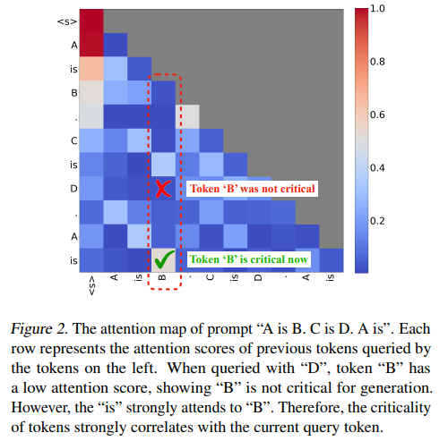
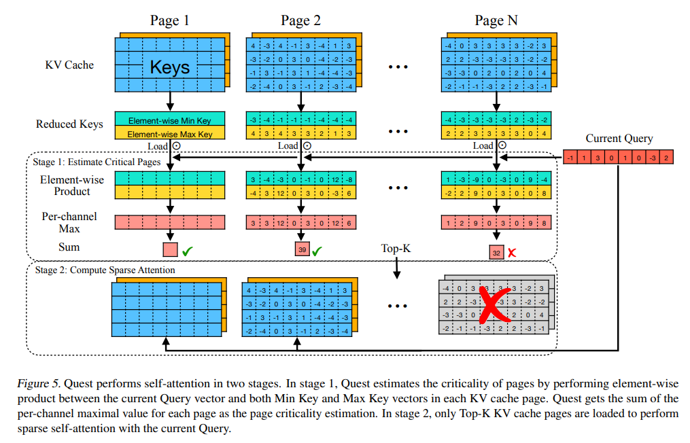
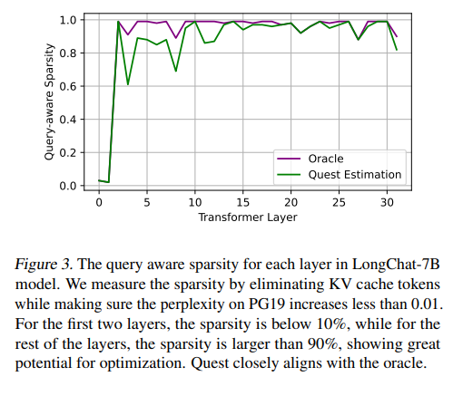
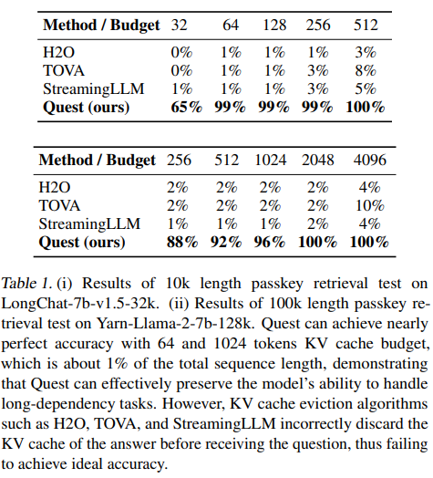
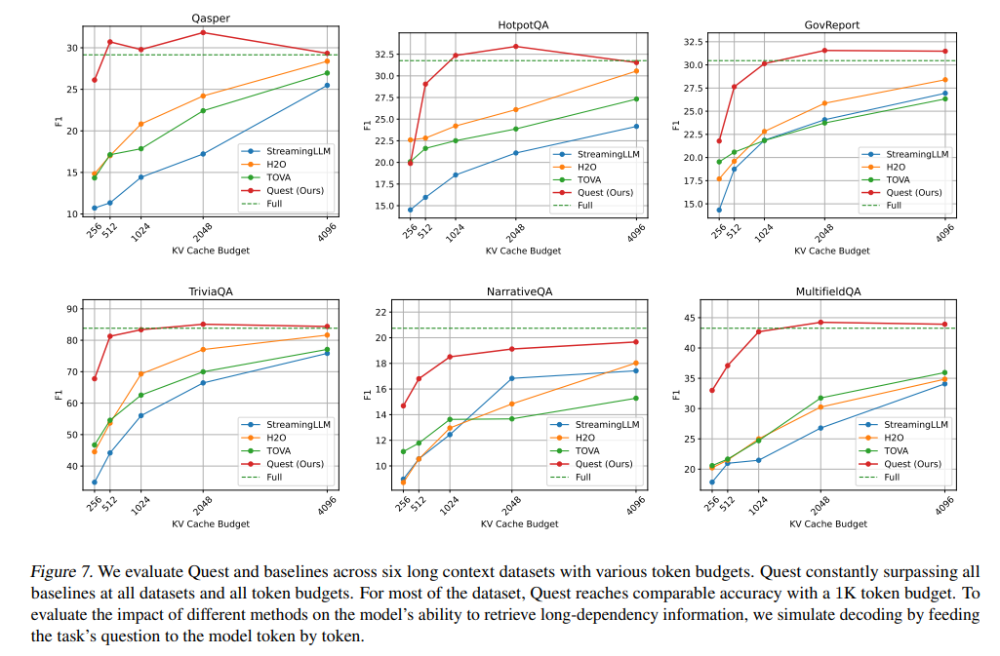

# 论文阅读报告：Quest - Query-Aware Sparsity for Efficient Long-Context LLM Inference

> **作者**: Jiaming Tang\*, Yilong Zhao\*, Kan Zhu, Guangxuan Xiao, Baris Kasikci, Song Han
> **单位**: 上海交通大学、MIT、华盛顿大学、NVIDIA
> **会议**: ICML 2024 (PMLR 235)
> **代码**: https://github.com/mit-han-lab/Quest

---

## Abstract 原文

> As the demand for long-context large language models (LLMs) increases, models with context windows of up to 128K or 1M tokens are becoming increasingly prevalent. However, long-context LLM inference is challenging since the inference speed decreases significantly as the sequence length grows. This slowdown is primarily caused by loading a large KV cache during self-attention. Previous works have shown that a small portion of critical tokens will dominate the attention outcomes. However, **we observe the criticality of a token highly depends on the query**. To this end, we propose **Quest**, a **query-aware KV cache selection algorithm**. Quest keeps track of the minimal and maximal Key values in KV cache pages and estimates the criticality of a given page using Query vectors. By only loading the Top-K critical KV cache pages for attention, Quest significantly speeds up self-attention without sacrificing accuracy. We show that Quest can achieve up to **7.03× self-attention speedup**, which reduces inference latency by **2.23×** while performing well on tasks with long dependencies with negligible accuracy loss.

---

## 1. 核心问题与研究动机

### 1.1 问题背景：长上下文推理的瓶颈

随着 GPT-4 Turbo (128K)、Claude-2 (200K) 等长上下文模型的普及，处理超长文本成为刚需。然而，长上下文推理面临严峻挑战：

| 挑战              | 具体表现                     | 量化数据  |
| ----------------- | ---------------------------- | --------- |
| KV Cache 内存占用 | Llama-7B @ 32K 上下文        | **16 GB** |
| 内存带宽瓶颈      | 加载 KV Cache 占解码时间     | **>50%**  |
| 延迟随长度增长    | 生成每个 token 需读取全部 KV | 线性增长  |

**关键洞察**：虽然 KV Cache 巨大，但 **自注意力具有高度稀疏性** —— 仅需一小部分 tokens 就能主导注意力结果。

### 1.2 核心发现：Token 关键性依赖 Query（本文核心贡献）

本文最重要的观察是：**同一 token 对不同 query 的关键性不同**。



**案例分析**（第2层，第16 head）：

| Query Token     | "B" 的注意力分数 | 关键性判断              |
| --------------- | ---------------- | ----------------------- |
| "D"             | 低 (~0.01)       | ❌ 不关键                |
| "is" (最后一个) | 高 (~0.8)        | ✅ **关键**（答案是"B"） |

**结论**：Token 关键性必须基于 **当前 query** 动态确定，而非预设或基于历史信息。

### 1.3 现有方法的局限

| 方法             | 策略                      | 核心局限       | 为什么失效                               |
| ---------------- | ------------------------- | -------------- | ---------------------------------------- |
| **H2O**          | 基于历史注意力分数保留 KV | Query-agnostic | 过去不重要的 token 对未来 query 可能关键 |
| **TOVA**         | 基于当前状态丢弃 KV       | 永久丢弃       | 信息不可恢复，损失长距离依赖             |
| **StreamingLLM** | Attention sink + 滑动窗口 | 局部窗口       | 窗口外信息完全丢失                       |
| **SparQ**        | 通道级稀疏                | 未充分验证     | 实际加速困难，效果存疑                   |

**核心问题**：现有方法都是 **query-agnostic**，无法适应动态变化的 token 关键性。

---

## 2. 方法设计：Query-Aware KV Cache 选择

### 2.1 核心思想

> **根据当前 Query 向量，动态估计并选择最关键的 KV Cache pages，仅加载这些 pages 执行注意力计算。**

**关键设计决策**：
1. **不预丢弃 KV**：保留所有信息，仅延迟加载
2. **Page 粒度**：基于 PageAttention，平衡精度与开销
3. **轻量级估计**：使用 Min/Max Key 快速估计上界

### 2.2 关键技术创新

#### 2.2.1 Page 关键性估计

**每页维护元数据**：
- **Min Key** (`m`): 该页各维度的最小值
- **Max Key** (`M`): 该页各维度的最大值

**关键性评分公式**：

$$
\text{Score}(\text{page}) = \sum_{i} \max(Q_i \times m_i, Q_i \times M_i)
$$

**理论保证**：该分数是 page 内任何 token 真实注意力分数的 **上界**。

$$
\text{Score}(\text{page}) \geq \max_{t \in \text{page}} (Q \cdot K_t)
$$

**为什么有效**：
- 对每一维 $i$，$\max(Q_i \times m_i, Q_i \times M_i)$ 覆盖了 $Q_i \times K_{t,i}$ 的最大可能值
- 求和后得到的是该 page 内最高注意力分数的上界
- 选择上界最高的 pages，不会漏选关键 token

#### 2.2.2 两阶段执行流程



**Stage 1: 关键 Page 估计**
1. 加载所有 pages 的 Min/Max Key 元数据（每页2个向量）
2. 计算每个 page 的关键性分数
3. 选择 Top-K pages

**Stage 2: 稀疏注意力计算**
1. 仅加载选中的 Top-K pages 的完整 KV
2. 执行标准 self-attention

**内存优化效果**：

```
完整 KV Cache: 2 × M × L
Quest 加载:     2 × M × L/S (metadata) + 2 × M × K × S (Top-K pages)
              = (1/S + K×S/L) × 完整KVCache
```

**典型配置** (PageSize=16, Sequence=64K, K=4K)：
- 加载比例 ≈ **1/8**
- **8× 内存减少**

### 2.3 分层稀疏策略



**关键发现**：

| 层范围    | 稀疏度 | 策略                        |
| --------- | ------ | --------------------------- |
| 第 0-1 层 | < 10%  | **保留完整 KV**（无法压缩） |
| 第 2+ 层  | > 90%  | 应用 Quest 稀疏选择         |

**为什么前两层不能稀疏**：
- 前两层提取基础特征，信息密度高
- 稀疏会导致困惑度显著上升（>0.01）
- 这与注意力可视化结果一致

---

## 3. 实验验证与结果分析

### 3.1 实验设置

**数据集**：
- **PG19**: 语言建模（100 books, 平均 70K tokens）
- **Passkey Retrieval**: 长距离依赖测试（10K, 100K）
- **LongBench**: 6个长上下文任务
  - 单文档 QA: Qasper, NarrativeQA, MultiFieldQA
  - 多文档 QA: HotpotQA
  - 摘要: GovReport
  - 少样本学习: TriviaQA

**模型**：
- LongChat-v1.5-7b-32k
- Yarn-Llama-2-7b-128k

**Baseline**：
- H2O (Heavy-Hitter Oracle)
- TOVA
- StreamingLLM

### 3.2 关键结果

#### 3.2.1 长距离依赖能力（Passkey Retrieval）


| 方法         | 10K (budget 64) | 100K (budget 1024) |
| ------------ | --------------- | ------------------ |
| H2O          | 1%              | 2%                 |
| TOVA         | 1%              | 2%                 |
| StreamingLLM | 1%              | 1%                 |
| **Quest**    | **99%**         | **96%**            |

**分析**：
- H2O/TOVA 因基于历史信息，可能丢弃对未来 query 关键的 token
- StreamingLLM 滑动窗口无法覆盖远距离信息
- **Quest query-aware 策略完美保留长距离依赖能力**

#### 3.2.2 多任务性能（LongBench）



**核心结果**：

| 数据集       | Quest (1K) vs Full Cache | 关键数字    |
| ------------ | ------------------------ | ----------- |
| Qasper       | 接近无损                 | 1/6 稀疏度  |
| HotpotQA     | 接近无损                 | 1/6 稀疏度  |
| GovReport    | 接近无损                 | 1/5 稀疏度  |
| TriviaQA     | 接近无损                 | 1/10 稀疏度 |
| NarrativeQA  | 接近无损                 | 1/5 稀疏度  |
| MultifieldQA | 接近无损                 | 1/6 稀疏度  |

**对比分析**：
- Quest **1K budget** ≈ Full Cache performance
- H2O/TOVA/StreamingLLM **4K budget** < Quest **1K budget**
- 证明 **query-aware 策略的样本效率优势**

#### 3.2.3 效率提升

**Self-attention 加速**：

| 序列长度 | FlashInfer | Quest  | Speedup |
| -------- | ---------- | ------ | ------- |
| 8K       | 20.3μs     | 10.2μs | 1.99×   |
| 16K      | 20.7μs     | 10.5μs | 1.97×   |
| 32K      | 21.2μs     | 11.1μs | 1.91×   |
| 128K     | 22.4μs     | 12.4μs | 1.81×   |

**端到端延迟**（图10, 第8页，4-bit 量化）：

| 序列长度 | FlashInfer | Quest    | Speedup   |
| -------- | ---------- | -------- | --------- |
| 8K       | 15ms       | 10ms     | 1.5×      |
| 16K      | 19ms       | 12ms     | 1.58×     |
| 32K      | 33ms       | **15ms** | **2.23×** |

**关键发现**：
- Quest 延迟基本 **恒定**（仅取决于 token budget，而非序列长度）
- 随着序列长度增加，优势更加明显
- 与 4-bit 量化兼容，可叠加优化

### 3.3 消融实验

**不同 Token Budget 的影响**（表1, 图7）：
- Budget 256: 部分任务性能下降
- Budget 512-1024: 大多数任务接近无损
- Budget 2048-4096: 完全无损

**推荐配置**：
- 32K 上下文：Budget 1024-2048
- 128K 上下文：Budget 4096

---

## 4. 评价与思考

### 4.1 优势

1. **问题洞察深刻**
   - 发现 token 关键性依赖 query 的核心现象
   - 从 attention map 可视化得到直观证据

2. **方法设计优雅**
   - Min/Max Key 估计简洁高效
   - 理论保证（上界估计）清晰
   - 与现有系统（PageAttention, FlashInfer）兼容

3. **实验验证充分**
   - 覆盖语言建模、检索、QA、摘要等多种任务
   - 32K/128K 多种长度验证
   - Kernel-level 和 end-to-end 效率评估

4. **实际价值显著**
   - 2.23× 端到端加速，部署友好
   - 精度无损，可替换现有推理流程

### 4.2 局限与边界

1. **前两层无法稀疏**
   - 必须加载完整 16GB+ KV Cache
   - 限制极端长序列（1M+）的优化空间

2. **固定 Page Size 和 Budget**
   - Page size=16 为经验值，未探索自适应
   - Token budget K 需预设，未根据输入动态调整

3. **模型规模验证有限**
   - 仅在 7B 模型上测试
   - 13B/70B 模型上效果待验证

4. **Prefill 阶段未优化**
   - 仅优化 decode 阶段
   - 长序列 prefill 也是瓶颈

### 4.3 可延伸方向

1. **与其他优化技术结合**
   - Speculative Decoding：Quest 选择关键 tokens + 草稿模型预测
   - 量化：Min/Max 元数据也可量化

2. **学习-based 关键性预测**
   - 当前基于规则的上界估计
   - 训练轻量级网络预测关键性，可能更精准

3. **多模态长序列**
   - 视频理解、长音频处理
   - 跨模态 attention 稀疏模式

4. **自适应策略**
   - 根据 layer、head、位置自适应选择稀疏度
   - 根据任务类型动态调整 budget

---

## 5. 总结

### 核心贡献

| 贡献         | 内容                         | 证据          |
| ------------ | ---------------------------- | ------------- |
| **理论洞察** | Token 关键性依赖 query       | 图2, 表1      |
| **方法创新** | Min/Max Key 快速估计         | 图5, 算法1    |
| **系统实现** | Quest query-aware 稀疏注意力 | 图8, 图10     |
| **实验验证** | 多任务无损 + 显著加速        | 图6, 图7, 表1 |

### 关键数字

- **7.03×**: Self-attention 加速
- **2.23×**: 端到端延迟改善
- **96-99%**: Passkey Retrieval 准确率（vs 1-2% baseline）
- **1/6 - 1/10**: 典型稀疏度

### 评价

Quest 是一篇优秀的系统论文，通过 **Query-aware 动态 KV Cache 选择**，解决了长上下文 LLM 推理的核心瓶颈。其洞察深刻、方法简洁、验证充分、效果显著，为稀疏注意力研究提供了重要思路。

---

## 参考文献

Tang, J., Zhao, Y., Zhu, K., Xiao, G., Kasikci, B., & Han, S. (2024). Quest: Query-Aware Sparsity for Efficient Long-Context LLM Inference. In *Proceedings of the 41st International Conference on Machine Learning* (PMLR 235).

---

